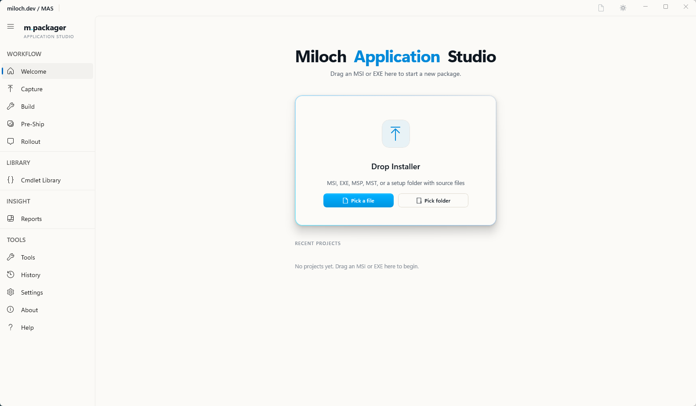
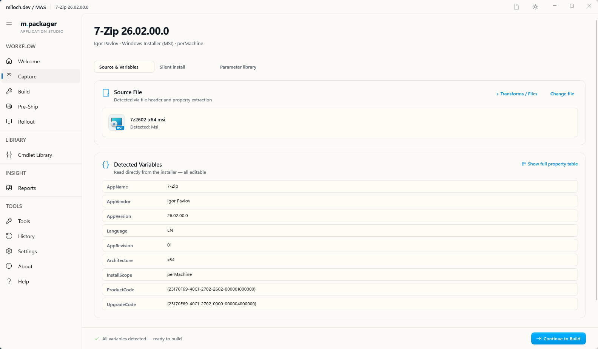
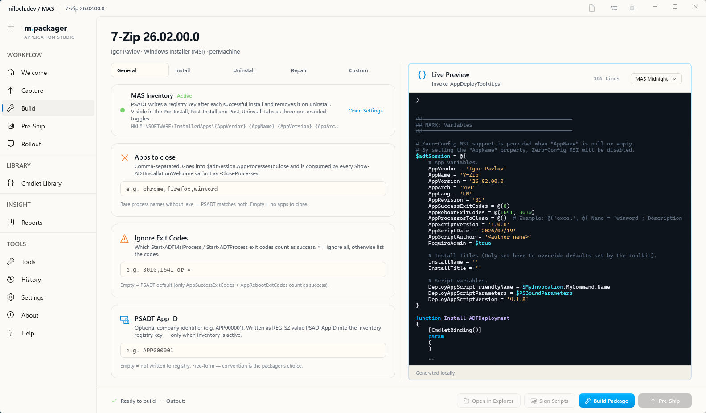
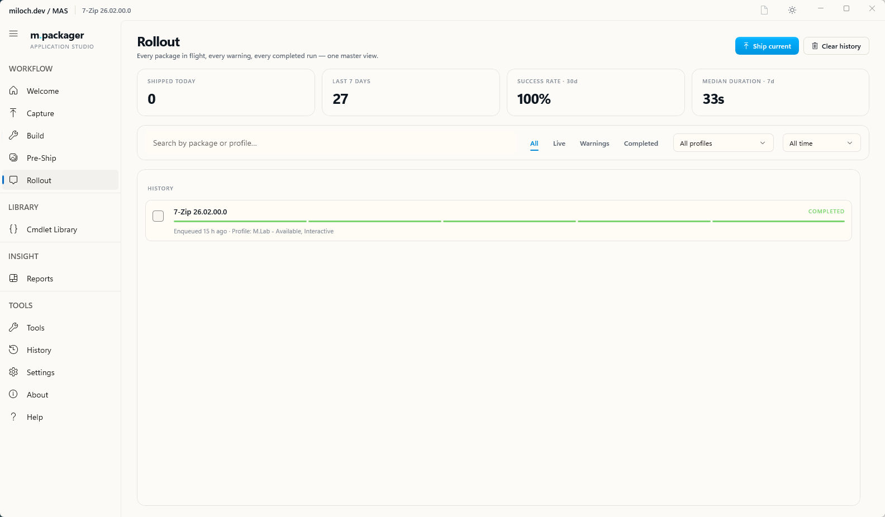
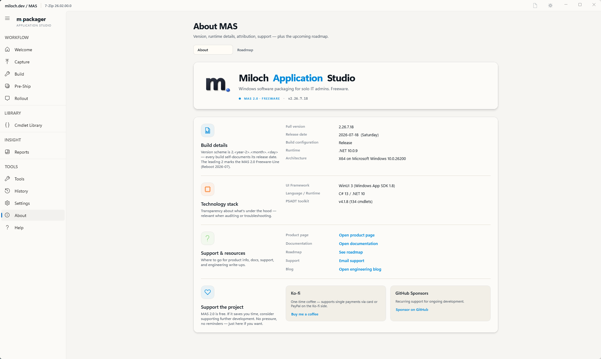

# Miloch Application Studio

**Free Windows desktop tool for the full path from an MSI or EXE to a deployed SCCM Application or Intune Win32App.**

PSADT-first · WinUI 3 · single-machine · no cloud · no licence key

[Download](https://github.com/JMiloch/miloch-application-studio/releases/latest) · [Documentation](https://miloch.dev/mas/docs/) · [Story](https://miloch.dev/mas/roadmap/) · [Support the project](https://miloch.dev/mas/#support)

---

## What it is

MAS takes a Windows installer, wraps it in a signed PSAppDeployToolkit v4 package, and ships it to your SCCM site or Intune tenant in one queue-tracked flow. The whole pipeline lives in a single WinUI 3 desktop application. There is no server, no cloud service, no licence to activate, no account to create — the version you install is the whole thing.

The project is **closed-source freeware**: the binaries are free to use, the source is not distributed. Releases are published here on GitHub and mirrored on [miloch.dev/mas](https://miloch.dev/mas/).

---

## Features

- **Capture** — drop an MSI, EXE, MSP or setup folder onto the Welcome page. MAS extracts vendor, version, product code, silent-install switches and detection rules.
- **Build** — generates a signed PSADT v4 workspace against the embedded template. Sign-after-build with your own code-signing certificate.
- **Ship queue** — atomic, resumable, audit-tracked delivery to SCCM (via ConfigurationManager module) or Intune (via Microsoft Graph). One click, both targets from the same profile if you want.
- **Per-package detection editor** — six modes (Profile default, MSI ProductCode, PSADT-Inventory registry, Registry key, File, Custom script) — pick per package or fall back to profile defaults.
- **Intune auto-assignments** — pre-defined AAD groups + intent from your profile land automatically after the Win32App is created. No second-page assignment step.
- **Software Memory Database** — SQLite-backed, remembers every package you've built. Re-open a two-month-old project without re-capturing.
- **Hash-chain audit** — every write to the Memory DB is chained by SHA-256. Tamper detection built in, external verification script included.
- **GDPR-ready** — five-click Subject Access Request bundle: subject → preview → save → archive → verify.
- **Local by default** — no telemetry upload, no cloud registration, logs and backups stay on your machine. A Diagnose ZIP is a manual export.

## Screenshots

*Capture — drop an installer, MAS surfaces vendor metadata, silent switches and detection candidates.*

*Build — signed PSADT v4 workspace generated against the embedded template, with Cmdlet Library and per-step edit hooks.*

*Rollout — every in-flight and completed ship in one master view, with live event timeline in the detail drawer.*

## Requirements

- Windows 10 or 11 (x64)
- .NET runtime is bundled with the installer — no separate install
- PowerShell 5.1 (ships with Windows)
- **Optional per feature**: SCCM Admin Console on the same machine (for SCCM push), a code-signing certificate in CurrentUser\My or LocalMachine\My (for signing generated scripts), an Entra ID app registration or interactive login (for Intune push)

## Install

1. Download the latest `MilochApplicationStudio-win-Setup.exe` from [Releases](https://github.com/JMiloch/miloch-application-studio/releases/latest).
2. Run it. Velopack installs MAS into `%LOCALAPPDATA%\MilochApplicationStudio\` and creates a Start-menu entry.
3. Launch MAS. Configure at least one profile in Settings → Profiles.
4. Drop your first installer onto the Welcome page.

**Updates** are checked automatically on launch and once per day while running. The applied delta is signed. You can disable auto-updates in Settings → Updates.

**Portable variant**: a `MilochApplicationStudio-win-Portable.zip` is published alongside each release — unzip anywhere, no installer.

## Documentation

Full documentation lives at **[miloch.dev/mas/docs](https://miloch.dev/mas/docs/)**. Highlights:

- [Installation](https://miloch.dev/mas/docs/000-Premise/010-installation/)
- [Vocabulary](https://miloch.dev/mas/docs/100-Foundations/110-vocabulary/) — what Capture / Build / Pre-Ship / Rollout mean
- [Your first package](https://miloch.dev/mas/docs/200-Quickstart/205-your-first-package/) — walkthrough with a real installer
- [Required settings](https://miloch.dev/mas/docs/400-Settings/410-required-settings/) — the minimum to get started
- [Common issues](https://miloch.dev/mas/docs/900-Troubleshooting/910-common-issues/)

## Support the project

MAS stays free. If it saves you real time on your packaging desk, coffee helps me carry the maintenance and keep the backlog moving.

- **[Ko-fi](https://ko-fi.com/miloch)** — one-time or recurring
- **[GitHub Sponsors](https://github.com/sponsors/JMiloch/)** — recurring or one-time via GitHub

Donations don't unlock anything. There are no perks and no in-app reminders — the same panel sits inside MAS on the About page, visible but out of the way:

## Feedback and issues

- **Bug or unexpected behaviour** → open an [Issue](https://github.com/JMiloch/miloch-application-studio/issues) with the *Bug report* template. If possible attach the Diagnose ZIP (Settings → Diagnostics → Support bundle).
- **Feature request** → open an Issue with the *Feature request* template, or start a [Discussion](https://github.com/JMiloch/miloch-application-studio/discussions).
- **Direct contact** → [dev@miloch.dev](mailto:dev@miloch.dev)

## Licence

Free to use privately and commercially. Source is not distributed. Redistribution of the binary requires attribution to `miloch.dev/mas`. Full terms in [LICENCE.md](LICENSE.md).

---

Built by **[Przemyslaw Milewski](https://github.com/JMiloch)** — Senior Endpoint & Workplace Engineer.
Part of the [miloch.dev](https://miloch.dev) toolset.

